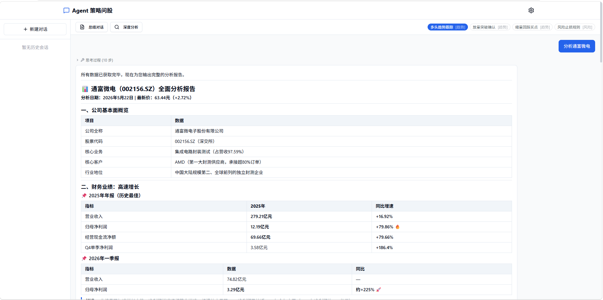

# Stock Web Chat — AI Agent 策略问股

基于 AI Agent 的多轮对话股票分析系统。支持自动调用知乎搜索、全网搜索、K线行情等工具，在回答中渲染走势图。

<p align="center">
  
</p>

## 快速开始

### 方式一：本地运行

```bash
git clone <repo-url> && cd stockWebChat

# 安装后端依赖
uv sync

# 安装前端依赖并构建
cd client && pnpm install && pnpm build && cd ..

# 启动（首次访问在浏览器设置 DeepSeek API Key）
uv run python main.py
# 访问 http://localhost:8978
```

开发模式（前后端分离）:

```bash
# 终端 1: 后端 (热重载)
uv run python main.py

# 终端 2: 前端 (Vite 热重载)
cd client && pnpm dev
# 访问 http://localhost:5173，自动代理 /api → :8978
```

### 方式二：Docker

```bash
docker compose up -d
# 访问 http://localhost:8978
```

Docker 使用多阶段构建：`node:22-alpine` 构建前端 → `python:3.12-slim` 运行后端。配置通过挂载 `./config.json:/app/config.json` 持久化。

### 方式三：GitHub Actions（自动构建镜像）

无需本地环境，Fork 后自动构建 Docker 镜像并推送到 GitHub Container Registry，拉取即可运行。

#### 1. Fork 本仓库

点击右上角 `Fork` 按钮。

#### 2. 启用 Actions

`Actions` 标签 → `I understand my workflows, go ahead and enable them`

#### 3. 触发构建

推送代码到 `main` 分支，或进入 `Actions` → `Build Docker Image` → `Run workflow` 手动触发。

构建完成后，Docker 镜像会推送到 `ghcr.io/<你的用户名>/stock-web-chat:latest`。

#### 4. 运行

```bash
# 拉取并启动
docker run -d -p 8000:8978 \
  -v /path/to/config.json:/app/config.json \
  ghcr.io/<你的用户名>/stock-web-chat:latest
```

或用 docker compose 部署到服务器：

```yaml
services:
  app:
    image: ghcr.io/<你的用户名>/stock-web-chat:latest
    ports:
      - "8000:8978"
    volumes:
      - ./config.json:/app/config.json
    restart: unless-stopped
```

### 方式四：Render（免费托管，自动获得 URL）

无需服务器，Fork 后部署到 Render 免费版即可获得公网访问地址。

#### 1. 准备工作

- [Fork 本仓库](https://github.com/你的用户名/stockWebChat/fork)
- 注册 [Render](https://render.com) 账号（GitHub 登录即可）

#### 2. 部署 Web 服务

Render Dashboard → `New +` → `Web Service` → 连接 GitHub 选中 fork 仓库，填写：

| 字段 | 值 |
| ------ | ---- |
| Name | `stock-web-chat`（或任意名称） |
| Region | 选离你最近的（亚洲选 Singapore） |
| Branch | `main` |
| Runtime | **Docker**（自动识别） |
| Plan | **Free** |

#### 3. 配置环境变量

展开 `Advanced` → `Add Environment Variable`，至少添加：

| 变量名 | 值 |
| ------ | ---- |
| `DEEPSEEK_API_KEY` | 你的 DeepSeek API Key |

可选：`DEEPSEEK_MODEL`、`DEEPSEEK_BASE_URL`、`ZHIHU_ACCESS_SECRET`、`FEISHU_APP_ID`、`FEISHU_APP_SECRET`、`FEISHU_BITABLE_ID`

#### 4. 创建

点击 `Create Web Service`，等待约 3-5 分钟构建部署完成。

部署成功后 Render 会自动分配 URL（如 `https://stock-web-chat.onrender.com`），打开即可使用。

> **注意**：Render 免费版 15 分钟无访问会自动休眠，唤醒需 30-60 秒冷启动。后续访问恢复正常速度。

## 配置说明

配置存储在浏览器 localStorage，首次访问会自动跳转到设置页。

> **部署到 Render 等云平台时**，在环境变量中配置（`DEEPSEEK_API_KEY` 等）。本地开发时也可用环境变量，或通过浏览器 `/settings` 页面填写。

| 配置项 | 说明 |
| ------ | ---- |
| `DEEPSEEK_API_KEY` | DeepSeek API Key (必填) |
| `DEEPSEEK_MODEL` | 模型名称 (默认 `deepseek-v4-flash`) |
| `DEEPSEEK_BASE_URL` | API 地址 (默认 `https://api.deepseek.com`，可填兼容 OpenAI 接口的第三方地址) |
| `ZHIHU_ACCESS_SECRET` | 知乎开放平台 Access Secret，启用知乎搜索 + 全网搜索 |
| `FEISHU_APP_ID` / `FEISHU_APP_SECRET` | 飞书应用凭证，启用对话持久化 + 策略 CRUD + 报告存储 |
| `FEISHU_BITABLE_ID` | 飞书多维表格 ID (留空则首次配置时自动创建) |

## 功能

- **Agent 多轮对话** — 自然语言分析股票，支持追问（DeepSeek ReAct 循环，最多 10 步 / 120s）
- **5 种工具调用** — K线数据、实时行情、标的信息、知乎搜索、全网搜索
- **走势图渲染** — 回答中渲染 K 线图（lightweight-charts 5.x），支持日/周/月/年周期切换、无限滚动加载历史
- **策略系统** — 内置 4 种交易策略（多头趋势、放量突破、缩量回踩、风险止损），可在聊天时选择策略约束分析视角
- **深度分析** — 结合对话上下文对指定股票做完整分析报告（180s 预算，8 步上限）
- **总结对话** — LLM 总结当前对话要点
- **设置页面** — 浏览器内配置 API Key、模型、知乎/飞书集成
- **会话管理** — 多会话切换、删除
- **飞书集成** (可选) — 对话持久化到飞书多维表格、策略 CRUD、分析报告存储
- **请求追踪** — 前后端关联日志，Action ID + Request ID 双层上下文，便于调试

## 项目结构

```text
stockWebChat/
├── main.py                        # uvicorn 启动入口
├── config.example.json            # 配置模板
├── pyproject.toml                 # Python 依赖
├── Dockerfile                     # 多阶段构建 (node:22 → python:3.12-slim)
├── docker-compose.yml

├── server/
│   ├── app.py                     # FastAPI 工厂 + CORS + tickflow 单例
│   ├── config_manager.py          # config.json CRUD + 验证
│   ├── routers/
│   │   ├── chat.py                # POST /api/chat/stream (SSE), /summarize, /deep-analysis, /sessions
│   │   ├── config.py              # GET/POST /api/config, /validate, /strategies
│   │   └── market.py              # GET /api/stock/klines, /api/stock/instrument
│   ├── agent/
│   │   ├── runner.py              # ReAct 循环 (max 10 步, 120s 墙钟)
│   │   ├── tools.py               # 5 个工具定义 + 执行
│   │   ├── client_ext.py          # DeepSeek 流式 LLM 客户端
│   │   └── conversation.py        # 内存会话存储 + 摘要
│   └── services/
│       ├── logger.py              # contextvars 上下文日志 (request_id + action_id)
│       ├── action_registry.py     # 用户操作 → API 映射注册表
│       ├── zhihu_search.py        # 知乎开放平台搜索封装
│       ├── feishu_client.py       # 飞书多维表格客户端 (3 张表)
│       └── strategies.py          # 策略加载 (本地 presets + 飞书自定义策略)

├── strategies/
│   └── presets.json               # 4 个内置策略

└── client/src/
    ├── main.ts / App.vue
    ├── router/index.ts            # /chat, /settings
    ├── stores/
    │   ├── chatStore.ts           # SSE 流式 + 消息 + 会话
    │   └── configStore.ts         # 配置状态
    ├── views/
    │   ├── ChatView.vue           # 主聊天界面
    │   └── SettingsView.vue       # 设置页（API Key、模型、知乎/飞书配置）
    └── components/
        ├── ChatMessage.vue        # 消息气泡 + 图表渲染 + 思考过程
        ├── StockChart.vue         # lightweight-charts K线组件
        ├── SessionSidebar.vue     # 会话侧边栏
        ├── StrategyEditor.vue     # 策略选择器
        ├── ConfigForm.vue         # 配置表单
        └── ui/                    # shadcn-vue 基础组件
```

## Agent / 工具系统

### ReAct 循环

```text
LLM(判断是否需要调用工具) → [tool_calls] → 执行工具 → 追加结果到消息 → 循环
                     ↘ [最终回答] → 解析 chart_specs → 返回 SSE
```

- 最大 10 步，墙钟 120s 预算（深度分析 8 步 / 180s）
- 同轮次内工具结果按 `tool_name:json_args` 去重缓存
- 图表规格从 LLM markdown 中用正则 ` ```chart_specs\n[...]\n``` ` 提取

### 工具定义

| 工具 | 数据源 | 说明 |
| ------ | ----------- | ------ |
| `get_klines` | tickflow | OHLCV 历史K线，支持周期/时间范围 |
| `get_realtime_quote` | tickflow | 实时行情 |
| `get_instrument_info` | tickflow | 标的信息 |
| `search_zhihu` | 知乎开放平台 | 知乎站内搜索 |
| `search_global` | 知乎开放平台 | 全网搜索 |

### 策略系统

内置 4 种策略定义在 `strategies/presets.json`，聊天时可选择一个或多个策略作为分析框架。策略指令会注入 system prompt，约束 LLM 的分析视角。飞书集成后可创建自定义策略。

## SSE 事件协议

SSE 事件由 `runner.py` 通过 `progress_callback` 发送：

```text
type: thinking          → { step, message }
type: tool_start        → { tool, display_name, args }
type: tool_done         → { tool, display_name, summary }
type: done              → { content, chart_specs, steps, session_id }
```

前端通过 `ReadableStream` 在 `chatStore.sendMessage()` 消费。

## API 参考

| 端点 | 方法 | 说明 |
| ------ | ---- | ------ |
| `/api/config` | GET | 获取当前配置 (敏感字段脱敏) |
| `/api/config/status` | GET | 检查配置是否完整 |
| `/api/config/validate` | POST | 验证配置 (可选测试飞书连接) |
| `/api/config/save` | POST | 验证并保存配置 |
| `/api/strategies` | GET | 获取所有可用策略列表 |
| `/api/chat/stream` | POST | SSE 流式 Agent 对话 |
| `/api/chat/sessions` | GET | 列出所有会话 |
| `/api/chat/sessions/{id}` | DELETE | 删除会话 |
| `/api/chat/summarize` | POST | 总结会话 |
| `/api/chat/deep-analysis` | POST | 深度分析指定股票 |
| `/api/stock/klines` | GET | K线数据 (参数: symbol, period, count, start_date, end_date, start_time, end_time) |
| `/api/stock/instrument` | GET | 标的信息 (参数: symbol) |

### K线 API 参数

`GET /api/stock/klines` 支持三种查询模式：

- **数量查询**: `symbol=600519.SH&period=1d&count=100` — 最近 N 条
- **日期范围查询**: `&start_date=2024-01-01&end_date=2024-03-31` — LLM 输出的 chart_specs 使用
- **时间戳滚动**: `&start_time=1704067200000&end_time=1711843200000` — StockChart 无限滚动加载

## 日志与可观测性

前后端通过 **Action ID + Request ID** 双层关联，便于调试：

```text
用户操作 → genActionId('chat.send.1745400000.a1b2')
  ↓ X-Action-Id header
后端: req_abc123 中间件注入 → contextvars 传播至 runner / tools / LLM
  ↓
控制台日志: [req_abc123][chat.send.a1b2] step 1/10 tool=get_klines done 0.3s
```

关键文件: `server/services/logger.py`、`server/services/action_registry.py`、`client/src/utils/actions.ts`

## 技术栈

- **后端**: Python 3.10+ / FastAPI / DeepSeek API / tickflow (免费行情) / httpx / lark-oapi
- **前端**: Vue 3 Composition API + TypeScript / Vite 8 / Pinia / Tailwind 3.4 / shadcn-vue / lightweight-charts 5
- **基础设施**: Docker 多阶段构建 / GitHub Actions

## License

MIT
